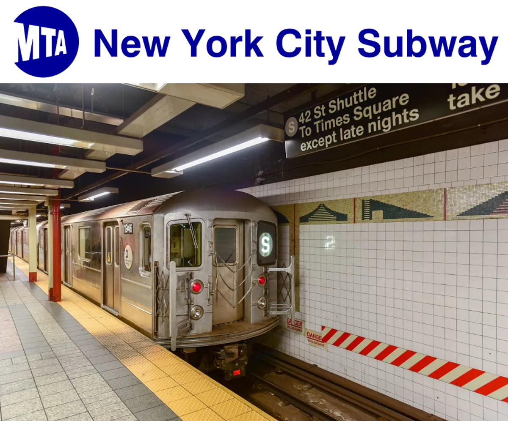

<div style="text-align:center;">

{width=750px height=500px}

<br>
<small>
Image source: <a href="https://tvtropes.org/pmwiki/pmwiki.php/UsefulNotes/NewYorkCitySubway">
TVTropes – New York City Subway
</a>
</small>

</div>


New York City has a well-known public transportation system, used by thousands every day. Unfortunately, not all trains are created equal. The MTA suggests that fare increases will soon be implemented, but with wavering opinions on the efficiency of the train lines, is this appropriate?

## Interactive Subway Map
```{r, include = FALSE}
knitr::opts_chunk$set(echo = FALSE)
```


```{r load_routes, child = "nyc_subway_routes.Rmd", include=FALSE}

```


```{r load_composite, child = "Composite_score.Rmd", include=FALSE}
# subway line directory table
```


<table style="width:100%;border-collapse: separate; border-spacing: 20px 0;"> 
<tr> 
<td style="vertical-align:top; width:60%;">
```{r show_map, echo = FALSE, fig.width= 5, fig.height= 4.5}
nyc_subway_routes
```

</td> 
<td style="vertical-align:top; width:40%;padding-left:20px;">

```{r show_score_plot, echo=FALSE, message=FALSE, warning=FALSE}
subway_directory_display_final
```
</td> 
</tr> 
</table>


##### Ranking System
We were able to rank the various subway lines through a [regression analysis](ranking_regression_analysis.html).


## Screen Cast

Our project screencast will be here.

(https://example.com/your-video-link) <!-- replace with real link -->


## Creators

| {width=200px height=160px}| {width=200px height=160px} | {width=200px height=160px}| {width=200px height=160px}|
|-----------------------------------|------------------------------------|--------------------------------------|----------------------------------------|
| **Shree** <br> MPH Candidate in Population and Family Health, Certificate in Applied Biostatistics  | **Jaia** <br> MPH Candidate in Epidemiology and Applied Biostatistics   | **Kennedy** <br> MPH Candidate in Epidemiology, Certificate in Applied Biostatistics and Public Health Data Science | **Yasmine** <br> MS Candidate in Epidemiology |


